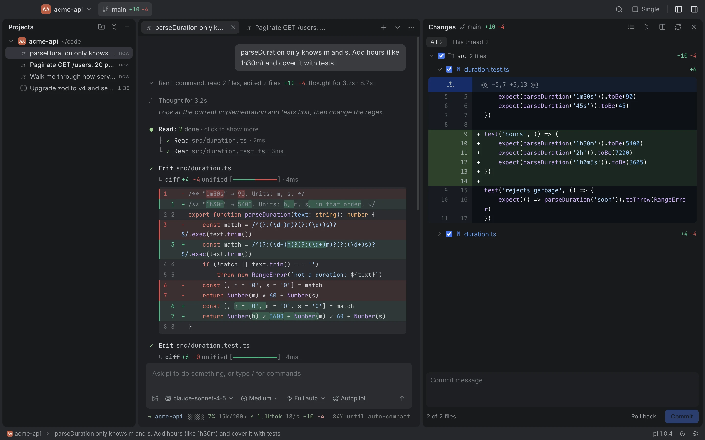

# Filo

A Mac app for coding agents. Run [pi](https://pi.dev), Codex, Claude Code and others in threads side by side, see which thread made each change, have a separate read-only pi review the work, and search every session. It shares sessions and settings with pi in your terminal, so you can switch back any time.



[简体中文](./README.zh-CN.md) · [filoapp.dev](https://filoapp.dev)

## Install

```bash
curl -fsSL https://filoapp.dev/install.sh | bash
```

Apple Silicon, macOS 11 or later. The script downloads the latest [release](https://github.com/nightsumx/filo/releases), checks its signature and installs to `/Applications` (`~/Applications` without admin rights). Run it again to update; quit Filo first. It replaces an older install named Pi.

No Node.js or pi CLI needed: Filo comes with its own pi, and uses yours if your login shell has one. Sign in to a subscription, add an API key or connect a local model under Settings → Model providers. It all goes to pi's own `~/.pi/agent`.

The app is not notarized. The `.dmg` from the releases page works too, but macOS blocks its first launch: open it once, then System Settings → Privacy & Security → Open Anyway.

## Features

- **One window per project**, like JetBrains, or several projects in one. Tabs drag between windows; the pi running in a tab keeps going.
- **Changes know their thread.** The changes panel shows which thread edited each file, flags files two threads both touched, and commits or rolls back the files you check.
- **Review.** After a turn, a separate read-only pi audits the diff against your requests (not the agent's reasoning) and runs commands for evidence. Issues are marked reproduced, with the command's exit code and output, or suspected. You pick what goes back to the agent.
- **Search every session** with ⌘⇧F, terminal sessions included; Enter opens the thread at that message.
- **Fork** any earlier prompt into a new tab.
- **No pop-ups.** Tool approvals, the agent's questions and plan sign-off are answered inline in the conversation.
- **Terminal pi, in the app.** pi running in a terminal shows up in the project tree (working, waiting for you, idle). With [pi-cc-tui](packages/pi-cc-tui) installed, opening its session joins that pi: its run streams into the app as it happens, and what you send from the app runs there, in one session file. Without it, the app follows the session file and warns that sending from both sides forks the conversation.
- **Other agents.** Codex, Claude Code, Grok Build, OpenCode, Gemini CLI, GitHub Copilot and Cursor run in the same threads over the [Agent Client Protocol](https://agentclientprotocol.com). The agent picker installs one into the app's own folder if you don't have it, and their own past sessions are listed and searchable.

## How it works

Each thread runs `pi --mode rpc` (or an ACP agent) as a child process of Electron's main process; the renderer talks to it over IPC. Sessions are pi's own JSONL files under `~/.pi/agent/sessions`, so the terminal and the app see the same history.

App features that need the agent's cooperation (approvals, questions, plan mode, todos, subagents, review, autopilot) are pi extensions in [`packages/capabilities`](packages/capabilities), loaded with `-e` per thread. [`packages/pi-cc-tui`](packages/pi-cc-tui) loads the same extensions in the terminal, with Claude Code style dialogs, plus the presence file and bridge socket the app uses to find and join terminal sessions.

| Path | What's there |
|---|---|
| `electron/` | Main process: pi and ACP processes, sessions, search index, git, presence, windows |
| `src/` | Renderer: React + MobX (`src/store`), features under `src/features` |
| `shared/` | Types and constants used on both sides (IPC, pi's RPC, agents, providers) |
| `packages/capabilities` | pi extensions shared by the app and pi-cc-tui; `protocol.ts` is the contract between them |
| `packages/pi-cc-tui` | Claude Code look for pi's terminal UI, published to npm |
| `bundled-pi/` | The pi version the app ships (lockfile), installed by `scripts/bundle-pi.sh` |
| `site/` | filoapp.dev, a Cloudflare Worker with static assets |
| `test/` | Vitest suites and end-to-end scripts that drive the built app over CDP |

## Development

Needs [Bun](https://bun.sh) and macOS.

```bash
bun install
bun run dev          # Vite + Electron with hot reload
bun run typecheck
bun run test         # vitest; runs real pi against a scripted model, no tokens spent
```

The end-to-end scripts launch the built app with a mock model and check it through the DevTools protocol. Build first; `SHOTS=<dir>` saves screenshots.

```bash
bun run build
bun run e2e:features   # also: e2e:windows, e2e:review, e2e:providers, e2e:acp, e2e:terminal
```

`e2e:terminal` and `test/bridge.test.ts` need tmux to run a real terminal pi.

The app runs in the background during these scripts (`PI_GUI_BACKGROUND=1`): no Dock icon, invisible windows, and it never takes focus. `PI_E2E_SHOW=1` shows it. Set `PI_GUI_BACKGROUND=1` yourself when launching the app with `--remote-debugging-port` by hand.

Packaging and release:

```bash
bun run dist             # bundles pi, builds the .dmg and .zip into release/
scripts/release.sh       # builds the committed HEAD and publishes GitHub release v<version>
bun run deploy:site      # deploys site/ with wrangler
```

`release.sh` refuses a tag that exists, so bump `version` in `package.json` first.

## License

[MIT](./LICENSE)
