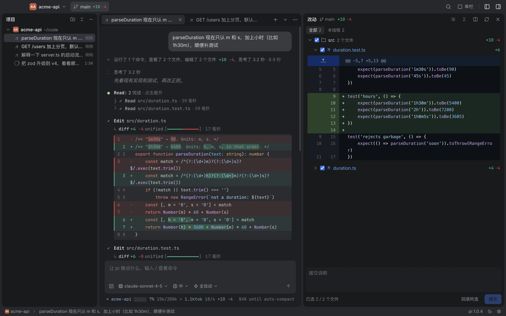

# Pi

[pi](https://pi.dev) coding agent 的 Mac 桌面端。多个线程并排跑，每处改动都知道是哪个线程做的，另起一个只读的 pi 审查结果，所有会话都能搜。和终端里的 pi 用同一份会话和配置，随时切回终端。



[English](./README.md) · [pi.flowsrun.com](https://pi.flowsrun.com)

## 安装

```bash
curl -fsSL https://pi.flowsrun.com/install.sh | bash
```

需要 Apple Silicon，macOS 11 及以上。脚本从 GitHub 下载最新的 [release](https://github.com/nightsumx/pi-kit/releases)，先校验签名，再装到 `/Applications`；没有管理员权限的话装到 `~/Applications`。再运行一次就是更新，运行前先退出 Pi。

不需要 Node.js 或 pi 命令行：Pi 自带一份 pi，登录 shell 里有你自己的 pi 就用你的。在“设置 → 模型供应商”里登录订阅、填 API key，或者接入本地模型，配置都存在 pi 自己的 `~/.pi/agent`。

应用没有经过 Apple 公证。也可以从 releases 页面下载 `.dmg`，但第一次打开会被 macOS 拦下：先打开一次，再到“系统设置 → 隐私与安全性”点“仍要打开”。

## 功能

- **一个项目一个窗口**，像 JetBrains 那样，也能把几个项目合到一个窗口。标签可以拖到别的窗口，标签里正在跑的 pi 不会中断。
- **改动归属到线程**。改动面板标出每个文件是哪个线程改的，两个线程改了同一个文件会提示；勾选文件直接提交或回滚。
- **独立审查**。一轮结束后，另起一个只读的 pi 对照你的要求审查 diff（看不到 Agent 的推理过程），并跑命令取证。真正复现的问题标“已复现”，附命令、退出码和输出；只靠读代码推断的标“推测”。你挑好条目再交回 Agent。
- **搜索所有会话**：⌘⇧F，终端里跑过的会话也在内，回车直接打开那个线程并定位到那条消息。
- **分叉**：从任意一次提问分叉出新标签。
- **不弹窗**：工具审批、Agent 的提问、计划确认都在对话里原地处理。
- **终端里的 pi 也在这里**。终端里运行的 pi 会出现在项目树里（在跑、等你回答、空闲）。装了 [pi-cc-tui](packages/pi-cc-tui) 的话，在桌面端打开同一个会话会直接连上那个 pi：终端里的运行实时显示在桌面端，在桌面端发送的消息也在那个 pi 里执行，会话文件只有一条线。没装的话，桌面端跟随会话文件刷新，并提醒你两边同时发送会让对话分叉。
- **其他 Agent**。Codex、Claude Code、Grok Build、OpenCode、Gemini CLI、GitHub Copilot 和 Cursor 通过 [Agent Client Protocol](https://agentclientprotocol.com) 跑在同样的线程里。没装的 Agent 可以在选择器里一键装到应用自己的目录；它们各自的历史会话也会列出来，可以搜索。

## 工作原理

每个线程在 Electron 主进程里起一个 `pi --mode rpc`（或 ACP Agent）子进程，渲染进程通过 IPC 和它通信。会话就是 pi 自己在 `~/.pi/agent/sessions` 下的 JSONL 文件，所以终端和桌面端看到的是同一份历史。

需要 Agent 配合的功能（审批、提问、计划模式、待办、子 Agent、审查）是 [`packages/capabilities`](packages/capabilities) 里的 pi 扩展，每个线程用 `-e` 加载。[`packages/pi-cc-tui`](packages/pi-cc-tui) 在终端里加载同一批扩展，换成 Claude Code 风格的对话框，另外提供桌面端用来发现和连接终端会话的 presence 文件和 bridge socket。

| 路径 | 内容 |
|---|---|
| `electron/` | 主进程：pi 与 ACP 进程、会话、搜索索引、git、presence、窗口 |
| `src/` | 渲染进程：React + MobX（`src/store`），各功能在 `src/features` |
| `shared/` | 两边共用的类型和常量（IPC、pi 的 RPC、Agent、模型供应商） |
| `packages/capabilities` | 桌面端和 pi-cc-tui 共用的 pi 扩展；`protocol.ts` 是两边的约定 |
| `packages/pi-cc-tui` | 让 pi 的终端界面像 Claude Code，发布在 npm |
| `bundled-pi/` | 应用自带的 pi 版本（lockfile），由 `scripts/bundle-pi.sh` 安装 |
| `site/` | pi.flowsrun.com，带静态资源的 Cloudflare Worker |
| `test/` | Vitest 测试，以及通过 CDP 驱动打包后应用的端到端脚本 |

## 开发

需要 [Bun](https://bun.sh) 和 macOS。

```bash
bun install
bun run dev          # Vite + Electron，热更新
bun run typecheck
bun run test         # vitest；用脚本化的模拟模型跑真实的 pi，不花 token
```

端到端脚本用模拟模型启动打包后的应用，通过 DevTools 协议检查。先 build；`SHOTS=<目录>` 会保存截图。

```bash
bun run build
bun run e2e:features   # 还有 e2e:windows、e2e:review、e2e:providers、e2e:acp、e2e:terminal
```

`e2e:terminal` 和 `test/bridge.test.ts` 需要 tmux 来跑真实的终端 pi。

打包和发布：

```bash
bun run dist             # 打包自带的 pi，把 .dmg 和 .zip 构建到 release/
scripts/release.sh       # 用已提交的 HEAD 构建，发布 GitHub release v<version>
bun run deploy:site      # 用 wrangler 部署 site/
```

`release.sh` 遇到已存在的 tag 会拒绝，所以先改 `package.json` 里的 `version`。
